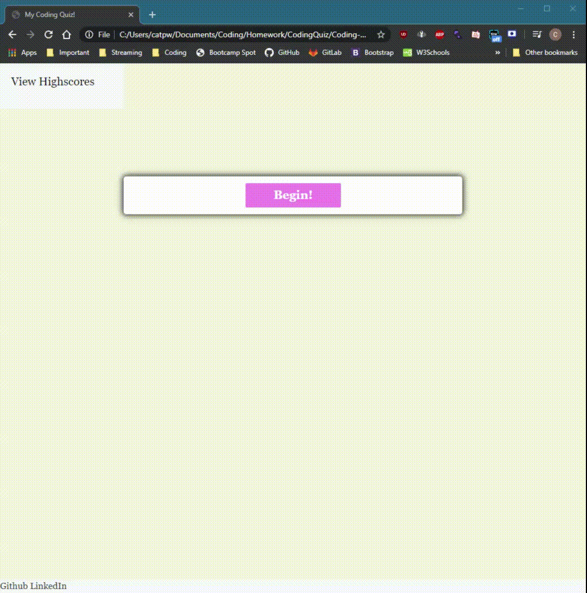

# Code Quiz!

# Description 
For this repo, my objective was to create an informational quiz on Javascript that would allow a smooth user experience. To make it even more exciting, the quiz is presented with a 2-minute timer, allowing it to start as soon as the user begins his/her quiz. If the user is to answer the question incorrectly, they will also lose 20 seconds on their timer each time. If the user completes all 5 questions, or the timer runs out- the quiz is over.

# Table of Contents 
* [Installation](#installation)
* [Usage](#usage)
* [License](#license)
* [Contributors](#contributors)
* [Test](#test)
* [Questions](#questions)
* [Contact](#contact)

# Installation
 
Answer the questions correctly before the timer runs out!

# Usage

github.com/Turtando/Coding-Quiz

# License

MIT

# Contributors

Christopher Turton

# Test

# Questions

N/A

## Contact
*To contact the developer, you may reach them at https://github.com/Turtando on GitHub or, you email directly at christopheraturton@gmail.com.*

