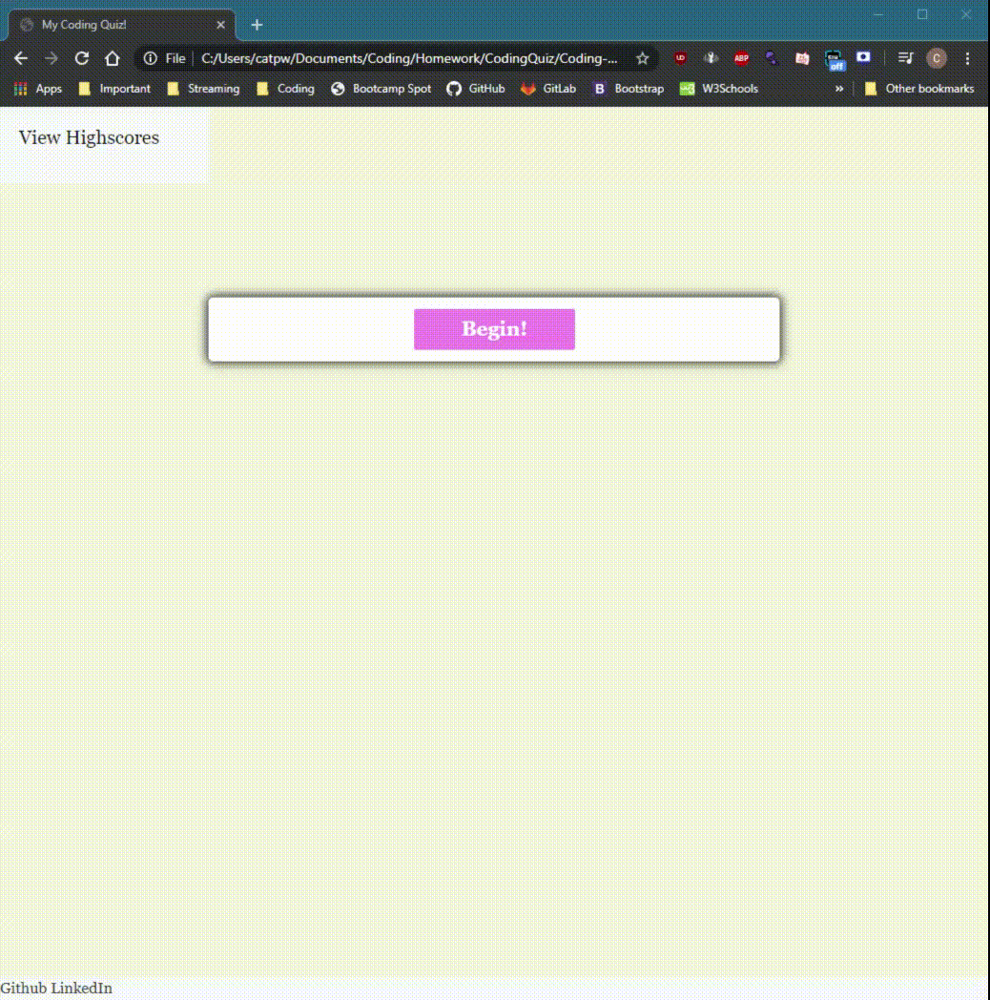

# Coding-Quiz

Greetings, 

For this repo, my objective was to create an informational quiz on Javascript that would allow a smooth user experience.
To make it even more exciting, the quiz is presented with a 2-minute timer, allowing it to start as soon as the user begins his/her quiz. 
If the user is to answer the question incorrectly, they will also lose 20 seconds on their timer each time. If the user completes all 5 questions, or the timer runs out- the quiz is over. 

Again, the content of the quiz is composed of 5 basic Javascript questions and cycle endlessly on random so that the testee is never presented with the same order. After the test is completed, the testee is immediately prompted to the results page, where they can see how they scored and also submit their high score along with their initials. Each high score that is submitted is then appended to the high scores html page, where the entire list can be seen. 

Primarily focusing on the basics of DOM manipulation and Web API In this application, you will see various elements of HTML, CSS and Javascript to make all the events and actions on the page appear and disappear in the same container. 

Thank you,
Chris Turton

https://github.com/Turtando/Coding-Quiz
https://github.com/Turtando?tab=repositories